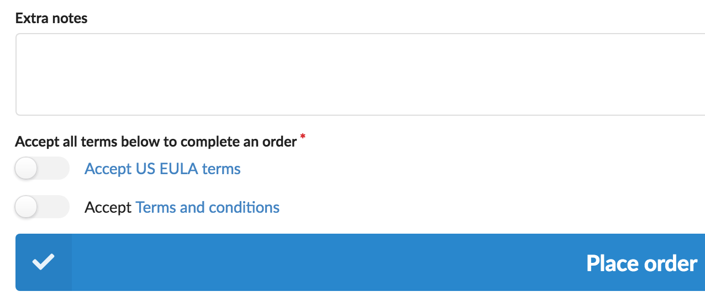

# Sylius terms and conditions plugin

[![Latest Version][ico-version]][link-packagist]
[![Latest Unstable Version][ico-unstable-version]][link-packagist]
[![Software License][ico-license]](LICENSE)
[![Build Status][ico-github-actions]][link-github-actions]
[![Code Coverage][ico-code-coverage]][link-code-coverage]

Will add a checkbox to the selects form(s) where the customer has to accept the terms and conditions before continuing.

This can be used to make sure the customer has accepted the terms and conditions before placing an order.

* [Screenshots](#screenshots)
* [Installation](#installation)

## Screenshots

### Shop

Before the customer can place order, he/she has to check the required terms



### Admin

Here is a list of terms. Notice the `terms_and_conditions` which is associated with multiple channels.


Notice that you select the form where the terms are shown. As default only the `Checkout > Complete` form is available,
but you can add more in the `setono_sylius_terms.forms` configuration option.


The `Label` field is the text shown on the complete order page. Notice you can use a placeholder (`[link:Link text]`) to tell where the link should be.


## Installation

### Step 1: Download the plugin

```bash
composer require setono/sylius-terms-plugin
```

### Step 2: Enable the plugin

Then, enable the plugin by adding it to the list of registered plugins/bundles
in the `config/bundles.php` file of your project:

```php
<?php
# config/bundles.php
return [
    // ...
    
    Setono\SyliusTermsPlugin\SetonoSyliusTermsPlugin::class => ['all' => true],
    
    // It is important to add plugin before the grid bundle
    Sylius\Bundle\GridBundle\SyliusGridBundle::class => ['all' => true],
    
    // ...
];
```

**NOTE** that you must instantiate the plugin before the grid bundle, else you will see an exception like `You have requested a non-existent parameter "setono_sylius_terms.model.terms.class".`

### Step 3: Import routing

```yaml
# config/routes/setono_sylius_terms.yaml

setono_sylius_terms:
    resource: "@SetonoSyliusTermsPlugin/Resources/config/routes.yaml"
```

There's also a version for non-localized stores: `@SetonoSyliusTermsPlugin/Resources/config/routes_no_locale.yaml`

### Step 4: Update your database schema

```bash
$ php bin/console doctrine:migrations:diff
$ php bin/console doctrine:migrations:migrate
```

### Step 5: Override checkout complete form

Override the [Sylius Form](https://github.com/Sylius/Sylius/blob/master/src/Sylius/Bundle/ShopBundle/Resources/views/Checkout/Complete/_form.html.twig):

* If you haven't your own `templates/bundles/SyliusShopBundle/Checkout/Complete/_form.html.twig` yet:

    ```bash
    $ cp vendor/sylius/sylius/src/Sylius/Bundle/ShopBundle/Resources/views/Checkout/Complete/_form.html.twig \
    templates/bundles/SyliusShopBundle/Checkout/Complete/_form.html.twig
    ```

* If you already have it:

    Add terms field (exactly this conditional way):

    ```twig
    {# templates/bundles/SyliusShopBundle/Checkout/Complete/_form.html.twig #}
    
        {{ form_row(form.terms) }}
    
    ```
    
    So the final template will look like this:

    ```twig
    {# templates/bundles/SyliusShopBundle/Checkout/Complete/_form.html.twig #}
    {{ form_row(form.notes, {'attr': {'rows': 3}}) }}
    
        {{ form_row(form.terms) }}
    
    ```

# Troubleshooting

* If you see `Neither the property "terms" nor one of the methods "terms()", "getterms()"/"isterms()"/"hasterms()" or "__call()" exist and have public access in class "Symfony\Component\Form\FormView".`

    Then see https://github.com/Setono/SyliusTermsPlugin/issues/13
    and double-check you added terms field at template like described
    at `Override checkout complete form` section.
    
* If you see `Grid "setono_sylius_terms_terms" does not exists`

    Then you forgot to import config from `Step 3: Import config` section.

[ico-version]: https://poser.pugx.org/setono/sylius-terms-plugin/v/stable
[ico-unstable-version]: https://poser.pugx.org/setono/sylius-terms-plugin/v/unstable
[ico-license]: https://poser.pugx.org/setono/sylius-terms-plugin/license
[ico-github-actions]: https://github.com/Setono/SyliusTermsPlugin/workflows/build/badge.svg
[ico-code-coverage]: https://codecov.io/gh/Setono/SyliusTermsPlugin/graph/badge.svg

[link-packagist]: https://packagist.org/packages/setono/sylius-terms-plugin
[link-github-actions]: https://github.com/Setono/SyliusTermsPlugin/actions
[link-code-coverage]: https://codecov.io/gh/Setono/SyliusTermsPlugin
